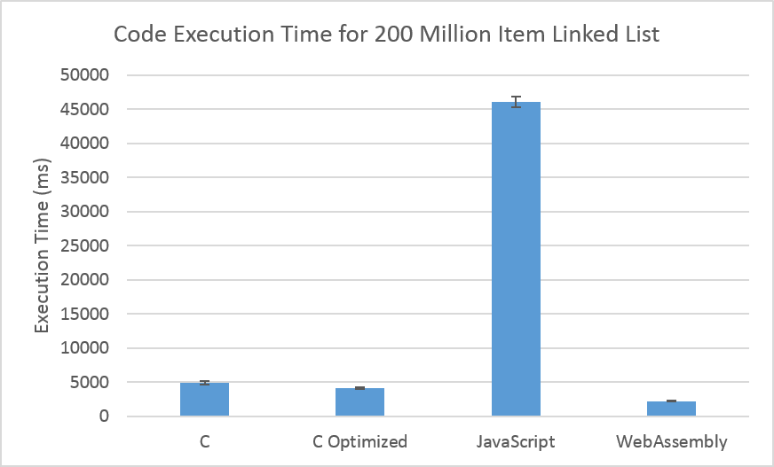
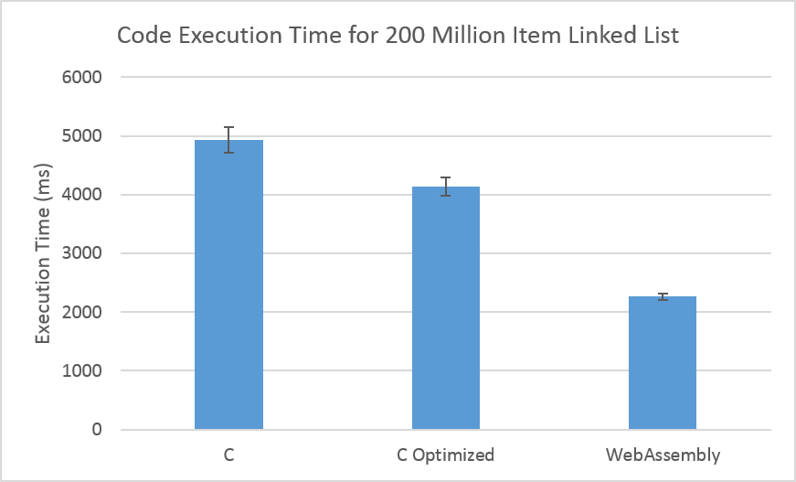
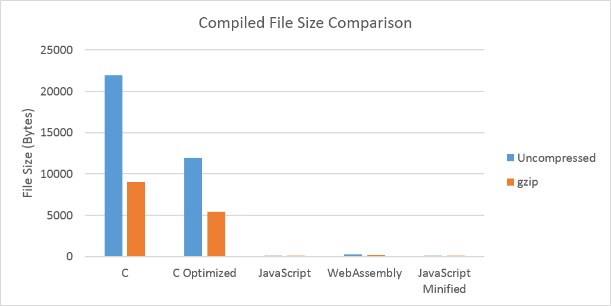
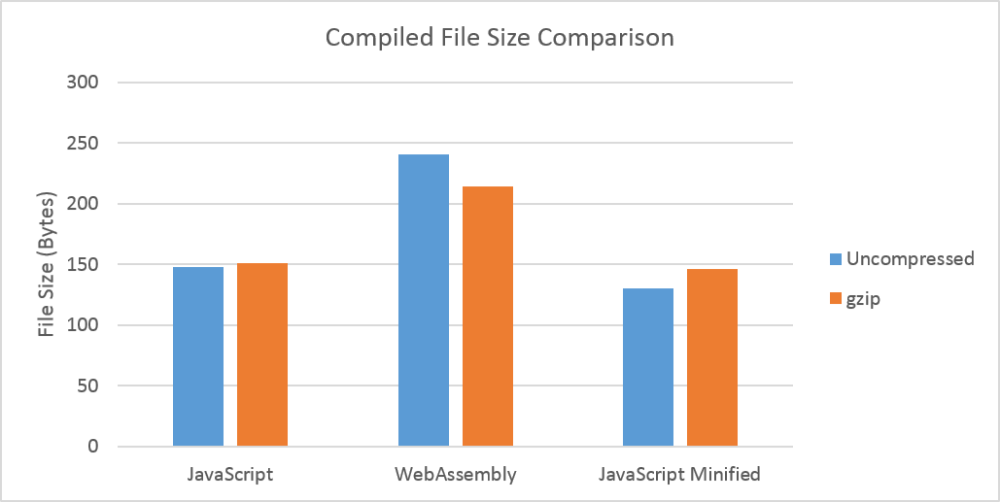

# WebAssembly_LinkedList
Linked list implementations in C, Javascript, and WebAssembly Text Format

> _For matrix multiplication, see [here](https://github.com/Dx724/WebAssembly_Matrices)_

- The code is separated into four types, with respectively named HTML and JS files.
- The folders in the root directory contain the code as demos, which show results in the debug console for the traversal of a three item linked list.
- The items in the LinkedLists are integers.
## Javascript
- Code written in plain javascript.
- Google Chrome experiences an OUT_OF_MEMORY_ERROR, crashing the tab, at approximately 300 million items.
## WebAssembly (WASM)
- Code written in WebAssembly text format.
- Chrome allows WebAssembly to allocate up to 4GB of memory, allowing this implementation to hold over 500 million items in the LinkedList.
## C
- Code written in C and compiled to WebAssembly via emscripten's emcc compiler.
- This code is compiled without optimizations and with the flags: -s ALLOW_MEMORY_GROWTH=1 -s MAXIMUM_MEMORY=4GB.
- Due to the way C stores the structs, this implementation supports up to ~300 million items before exceeding the 4GB memory limit.
## C Optimized
- Code written in C and compiled to WebAssembly via emscripten's emcc compiler.
- This code is compiled with the -O3 flag to enable all optimization options, and also the same flags as above in the C code.
- As above, the memory limit is reached past ~300 million items.
#Performance Testing
- Each of the linked list implementations were used to create 200 million item linked lists and then they iterated through them.
- Each implementation was tested 10 times and the data can be shown below.
- Standard deviation bars are included.

## Various Notes
- No extensive debug console outputs are present during performance testing, as repeated console.log calls are relatively expensive (all outputs are stored in memory).
- The -mx32 flag, which makes the compiled C code use 32-bit pointers instead of 64-bit points would allow more items to be stored in the linked list, although with a performance cost.
- Utilizing a global variable rather than the memory object in the WASM code resulted in an additional slowdown of ~3s. It is kept in the three-item demo code for clarity.
- The usage of a local variable to temporarily store the free memory pointer in the WASM code does not result in a significant speed increase.
- The time to allocate 4GB of memory for WASM is ~300 ms.
- However, if this memory is allocated slowly in 100 page chunks, execution time increases by almost 30s.
- The compile and instantiation process of the WASM module at runtime takes under 100 ms.
- Utilization of -s TOTAL_MEMORY=1999MB in compilation or growing WASM memory to 4GB before running the C code results in a ~2.5s slowdown.

# File Size Comparison
- The file sizes of the compiled files being sent to browsers was measured, both with and without gzip compression.
- For the Javascript code, the file was changed to have single-letter names.
- A minified version of the Javascript is also included in the data below.

# Conclusions
- Overall, handwritten WebAssembly is much faster than Javascript code, and substantially faster than generated code as well.
- Potential reasons for this include Javascript interpretation time costs, bulky-but-widely-compatible emscripten-generated functions, and unnecessary object metadata.
- At internet speeds over 18 bits per second (1.8\*10-5 Mbps), the WASM code would be a better choice overall.
